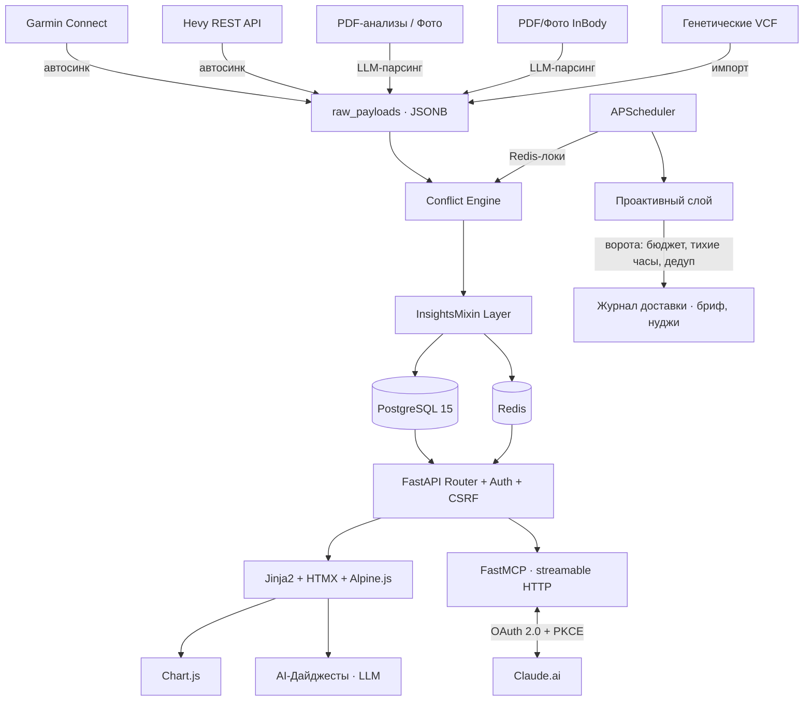
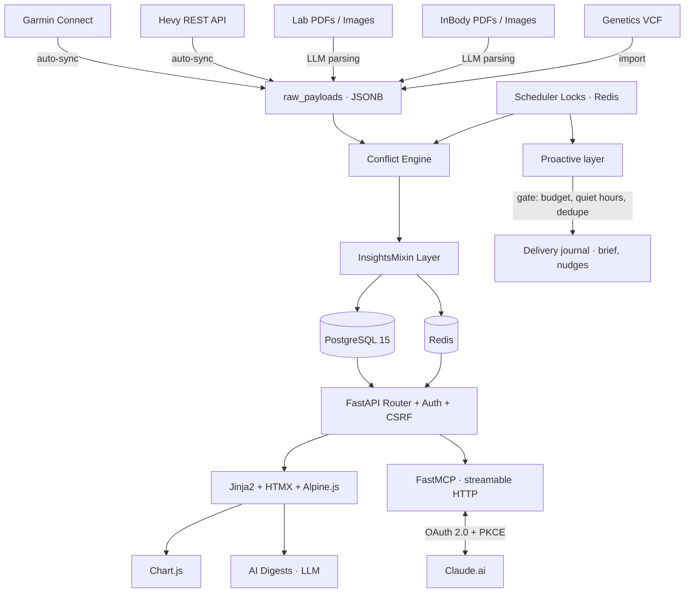

<p align="center">
  <picture>
    <source media="(prefers-color-scheme: dark)" srcset="https://img.shields.io/badge/Vitals-Personal_Health_Dashboard-F5A623?style=for-the-badge&labelColor=1a1a2e">
    
  </picture>
</p>

<p align="center">
  <strong>Self-hosted personal health data lake & dashboard with 69 MCP tools for Claude.ai</strong><br>
  <sub>Masthead UI · EN/RU interface · 14 Domains · Weight & BIA · HRT/TRT · GLP-1 · Garmin · Hevy · Nutrition · Labs · Genetics · Skincare · Timeline · AI Digests · Doctor Report</sub>
</p>

<p align="center">
  
  
  
  
  
  
  
  
  
  
  
  
  
</p>

<p align="center">
  
</p>

<p align="center">
  <a href="#vitals---личный-кабинет-здоровья-и-data-lake"> Русский</a> &nbsp;·&nbsp;
  <a href="#vitals---personal-health-dashboard-and-data-lake"> English</a>
</p>

---

## Vitals - Личный кабинет здоровья и data lake

**Vitals** — персональный дашборд здоровья и полноценное «озеро данных» (data lake) для одного пользователя. Система спроектирована для долгосрочного отслеживания биомаркеров, рекомпозиции тела, контроля терапии GLP-1, прохождения курсов гормональной терапии (ГЗТ / TRT), анализа спортивных показателей и построения еженедельных AI-отчётов с помощью языковых моделей через OpenRouter.

Интерфейс полностью стандартизирован на единственной оболочке **Masthead** — издательском (editorial) дизайне с тёплой глубокой темой (`#1D1A21` / `#332F3C`), milk-white текстом, точечными акцентами цвета янтарного мёда (`#F5A623`) и высококлассной типографикой (Outfit/Bricolage Grotesque/Inter, без использования моноширинных шрифтов). Дизайн-система целиком описана в [docs/DESIGN_SYSTEM.md](docs/DESIGN_SYSTEM.md).

Главное отличие от фитнес-трекеров — **принцип максимального сохранения сырых данных**. Vitals — умный навигатор здоровья, который подсвечивает неочевидные взаимосвязи между сном, тренировками, медикаментами и весом, помогая принимать взвешенные решения. Не надзиратель — штурман.

У Vitals есть **голос**: проактивный слой сам собирает утренний бриф и подсказки по условию, вместо того чтобы ждать, пока в дашборд зайдут. Транспорт сейчас один — сама страница `/reports`; пуши в PWA — следующий.

### Зачем я это сделал

Мои данные были разбросаны по многим приложениям: Garmin, Hevy, заметки по GLP-1 и ГЗТ, таблица с анализами, файл с добавками. Ни одно из них не умело сопоставлять сон с восстановлением после тренировки или связывать побочные эффекты терапии с питанием — всё приходилось держать в голове.

Vitals написан с Claude в качестве основного инструмента разработки — но модель данных, архитектура и доменная структура мои. MCP-слой — ключевая часть: Claude может в реальном времени читать и записывать данные по всем 15 доменам, отвечая на вопросы вроде «как мой сон за последнюю неделю влияет на восстановление?» с конкретными цифрами.

### Что умеет

<p align="center">
  
</p>

<table>
<tr>
<td width="50%">

**📊 Данные и аналитика**
- 15 независимых доменов здоровья, терапии и хронологии
- Автосинк Garmin Connect + Hevy API
- OCR-парсинг анализов через LLM (Gemini)
- Vision-парсинг бланков состава тела InBody / МедАсс (BIA)
- Движок конфликтов: 116 курируемых правил (усвоение, фармакогенетика, дерматология, безопасность анализов, GLP-1, ГЗТ, противопоказания)
- 7-дневное скользящее среднее + линейная регрессия
- Детекция плато на GLP-1
- Кросс-доменная хронология событий (Timeline) + флажки-аннотации на графиках
- Кастомные графики: наложение любых метрик друг на друга

</td>
<td width="50%">

**🤖 AI и интеграции**
- Еженедельные AI-дайджесты (Claude / GPT) из версионированного контекста за закрытый период: Garmin и Hevy, GLP-1 и ГЗТ, состав тела, анализы, питание и остальные включённые домены
- Проактивный слой: утренний бриф и подсказки по условию, с тихими часами и дневным бюджетом сообщений
- 69 MCP-инструментов для Claude.ai (чтение + запись + override)
- OAuth 2.0 + PKCE авторизация MCP
- Полный экспорт данных для LLM (copy-paste ready)
- Атомарный бэкап и восстановление БД
- Настраиваемые модели через OpenRouter

</td>
</tr>
<tr>
<td>

**📱 Мобильный опыт**
- PWA с установкой на Home Screen (iOS/Android)
- Двуязычный интерфейс (русский / английский) — переключение в настройках
- Адаптация под все размеры (Mobile / Tablet / Desktop)
- HTMX — мгновенные переходы без перезагрузок страниц
- Alpine.js — микро-интерактивность на клиенте
- Chart.js — адаптивные графики с кастомными оверлеями

</td>
<td>

**🔒 Приватность и контроль**
- Self-hosted, single-user, behind VPN
- Bcrypt-авторизация + подписанные сессии
- Двухфакторный вход (TOTP) — по желанию, включается в настройках
- CSRF + Origin Guard + CSP
- Модульный дашборд — включай/выключай домены в настройках
- Никаких внешних CDN — шрифты и стили полностью локальные
- Отчёт для врача: снимок за период по ссылке с паролем и сроком жизни

</td>
</tr>
</table>

---

### 📖 Содержание

- [Философия и ключевые принципы](#-философия-и-ключевые-принципы)
- [Домены данных (15 модулей)](#-домены-данных)
- [Архитектура системы](#-архитектура-системы)
- [MCP-интеграция с Claude.ai (69 инструментов)](#-mcp-интеграция-с-claudeai)
- [Быстрый старт (Docker Compose)](#-быстрый-старт)
- [Безопасный деплой (Сетап автора)](#-безопасный-деплой-сетап-автора)
- [Параметры конфигурации (.env)](#-параметры-конфигурации)
- [Разработка и тесты](#-разработка-и-тесты)
- [Поддержать проект](#-поддержать-проект)
- [Лицензия](#-лицензия)

---

### 🧠 Философия и ключевые принципы

> [!NOTE]
> **1. Сохранность сырых данных (Raw Payloads Store)**
> Все интеграции сохраняют исходные ответы API в JSONB-таблицу `raw_payloads` параллельно со структурированными записями: Garmin, Hevy, анализы, BIA-бланки, исходный VCF и входящие сообщения бота. Если завтра обновится парсер — вся история перепарсится без потерь, и это не обещание на словах: ночная задача `raw_payload_sweep` (03:30) заново разбирает всё, что помечено «нужен перепарс», по каждому домену независимо.

> [!TIP]
> **2. Движок конфликтов (Conflict Engine)**
> Данные, не код: **116 курируемых правил** с источниками и уровнем доказательности (A/B/C) в `vitals/data/conflict_rules.yaml`, покрывающих усвоение нутриентов, фармакогенетику, дерматологию, безопасность по анализам, GLP-1, ГЗТ/TRT и противопоказания. Правила понимают не только точное совпадение, но и диапазоны (`доза ≥ 2 мг`), списки, «любое из», и разносят предупреждение по времени приёма (утро/вечер/с едой), а не только по факту совместности. Несовместимая добавка с генетикой или анализом вернёт `409 Conflict`; можно нажать «Записать всё равно (Override)» — причина запишется в лог. Каталог просматривается и включается/выключается на странице `/interactions`.

> [!IMPORTANT]
> **3. Локализованное время (Timezone Engine)**
> Время «сегодня» и границы дат строго в зоне пользователя (`VITALS_TIMEZONE`). Никаких сбитых графиков при вечерних тренировках. Всё время через `vitals/utils/timeutils`.

> [!CAUTION]
> **4. Self-hosted & Single-User Privacy**
> Биометрические данные принадлежат только вам. Деплой на собственный сервер за VPN. Сессионные куки, bcrypt-пароль, CSRF-защита.

> [!TIP]
> **5. Полная переносимость данных (Data Portability)**
> Система не запирает данные. Полная резервная копия БД (включая сырые ответы API) для миграции. Компактный текстовый экспорт (LLM-ready) для вставки в чат с Claude/ChatGPT. Атомарное восстановление из бэкапа в одной транзакции.
>
> Отдельная дорога наружу — **отчёт для врача** (`/share`): выбираешь разделы и период, приложение замораживает снимок и отдаёт ссылку с паролем. Ссылка живёт заданное число дней, отзывается в один клик, считает открытия и в бэкап не попадает. Тот же документ скачивается одним самодостаточным HTML-файлом — без скриптов и внешних запросов, открывается офлайн двойным кликом и печатается. Снимок неизменяемый: данные поменялись — создаёшь новый отчёт, а не подменяешь тот, что уже у врача на руках.

---

### 📊 Домены данных

Все домены объединены общим интерфейсом `InsightsMixin` (`date`, `domain`, `source` + составной индекс):

<details>
<summary><strong>⚖️ 1. Вес и состав тела</strong></summary>

- **Модели**: `WeightLog`, `BodyMeasurement`, `NoiseMarker`, `ProgressPhoto`
- Расчёт % жира по формуле Navy (шея, талия, бёдра) и безжировой массы тела (LBM)
- 7-дневное скользящее среднее с исключением шумовых периодов (`NoiseMarker`)
- Линейная регрессия: скорость кг/неделю и прогноз даты цели
- Прогресс-фотографии с привязкой к дате (пакетная загрузка до 5 штук)
- Приоритет источников веса: ручной ввод ≈ BIA-скан > Garmin (Garmin никогда не перекрывает)
</details>

<details>
<summary><strong>📊 2. Состав тела InBody / МедАсс (BIA-сканы)</strong></summary>

- **Модели**: `BodyScan`, `BodyScanMetric`
- Загрузка PDF / фото листка анализатора (InBody / МедАсс) → LLM vision-модель распознаёт **все** доступные метрики (скелетная мускулатура, минералы, белок, висцеральный жир, внеклеточная вода, фазовый угол, сегментарный анализ, общий балл)
- Интерактивная таблица предпросмотра для валидации данных перед сохранением
- Жир% и LBM от BIA-скана и Navy сосуществуют на одном графике как разные источники
- Реестр метрик описан в `vitals/services/analytics/body_metrics.py` (не требует БД-каталога)
</details>

<details>
<summary><strong>⚗️ 3. Гормональная терапия (ГЗТ / TRT)</strong></summary>

- **Модели**: `HrtCompound`, `HrtDose`, `HrtCycle`, `HrtCycleItem`, `HrtCycleTemplate`, `HrtSideEffect`
- Курируемый каталог из **73 препаратов** (`hrt_compounds.yaml`): эфиры тестостерона, 19-норы, оральные ААС, ингибиторы ароматазы / SERM, ХГЧ, ГР / IGF-1 / пептиды — с эфиром, путём введения, периодом полураспада и долей активного гормона
- Лог приёмов с пересчётом **мл → мг** (объём × концентрация) и полями серого рынка (бренд / лаба / партия / фактическая концентрация); ротация мест инъекций
- Полноценные курсы (`HrtCycle`): два типа — **курс** (любой протокол на экзогенных гормонах) и **ПКТ** (свой каденс анализов), движок расписания (сегменты + линейная рампа, фиксированная сетка, дробные интервалы вроде E3.5D) и server-side кривая **активного релиза** (сумма экспоненциальных распадов по периоду полураспада × доле активного гормона)
- Напоминания: контроль анализов на курсе (гормональная панель в каталоге Labs) и пропущенные инъекции; `soft_warn`-правила hrt↔labs (оральные 17-αα + повышенные АЛТ/АСТ, тестостерон + гематокрит, 19-нор + пролактин) через Conflict Engine
- Сложные многонедельные протоколы: у каждого препарата своя **неделя старта** внутри курса (оффсет от начала); **шаблоны курсов** — сохранение плана как повторно используемого шаблона без дат и обмен шаблонами между инстансами через портируемый JSON (экспорт/импорт со строгой валидацией)
- Только учёт, без рекомендаций по дозам (harm reduction)
</details>

<details>
<summary><strong>💉 4. Протокол GLP-1</strong></summary>

- **Модели**: `Injection`, `DosePhase`, `SideEffect`
- Хронологический лог инъекций (Semaglutide / Tirzepatide) с интерактивной картой точек инъекции (ротация мест для избежания липогипертрофии)
- Линейная шкала фаз дозировок для наложения на графики веса
- Детекция плато: если доза >14 дней и тренд <100 г/неделю → автоматическое предупреждение
</details>

<details>
<summary><strong>⌚ 5. Garmin Connect</strong></summary>

- **Модели**: `GarminDaily`, `GarminActivity`, `GarminIntraday`, `GarminWeightExport`
- Автосинк: сон, фазы сна, HRV (вариабельность пульса), пульс покоя, стресс, Body Battery, Training Readiness + внутридневные кривые стресса и Body Battery
- Сессия `garminconnect` (библиотека пиновая — 0.3.7): токены в Redis + бэкап на диск, том с токенами попадает в `backup.sh` рядом с дампом БД
- **Предохранитель логина**: вход по паролю рационируется (3 раза в 24 ч, потом пауза 6 ч, счётчики в Redis) — Garmin блокирует аккаунт за частые попытки, и каждый ретрай продлевает блок. Живой токен предохранителя не касается; MFA и «залогинились слишком часто» различаются в алертах
- Расписание опроса — не в `.env`, а на карточке «Проактивный слой» в `/settings`: интервал полного синка + лёгкий пульс (шаги за сегодня) между ними, применяется без перезапуска контейнера
- **Вес обратно в Garmin (opt-in)** — карточка Garmin отправляет только самое свежее прямое измерение (ручное, MCP или BIA), никогда не возвращает импорт Garmin обратно и не переносит историю. Интервал (по умолчанию 15 минут) и окно свежести (не больше 30 дней) настраиваются на живом планировщике без перезапуска; кнопка **«Отправить сейчас»** запускает явную сверку. Новые логин и пароль начинают действовать в текущем процессе, а без реквизитов фоновая задача тихо ничего не делает
- **Консервативная запись веса** — перед каждым POST Vitals заново читает день Garmin и пишет только в пустой день. Одна уже существующая запись с тем же весом отмечается как внешнее совпадение, а не как принадлежащая Vitals; другой вес, несколько записей или неполный ответ Garmin дают видимый конфликт без добавления дубля и без удаления чужих данных. Коррекция заменяет только точный `samplePk`, подтверждённый для POST Vitals, и лишь после проверки, что день снова пуст
- **Неопределённость и удаление** — до сетевого POST Vitals фиксирует в БД durable-маркер «не проверено» с зарезервированной миллисекундной меткой, поэтому crash/rollback не возвращает операцию в очередь на повторную отправку. Обычно Garmin отвечает `204` без `samplePk`; тогда владение подтверждается только одной-единственной read-back записью с точным совпадением этой метки, источника `MANUAL` и веса. Совпадения только по весу недостаточно: планировщик и кнопка «Отправить сейчас» продолжают безопасную сверку и никогда не повторяют неопределённый POST. Удаление локального веса ставит в очередь удаление только подтверждённой записи Garmin, а монотонный курсор не позволяет после удаления или повторного включения выгрузить более старое измерение. Запись идёт через неофициальный web API `garminconnect`, поэтому функция по умолчанию выключена
- Полностью переработанный раздел сна с детализированной страницей каждой ночи
- Резервный канал: импорт JSON-экспортов из Health Auto Export
</details>

<details>
<summary><strong>🏋️ 6. Тренировки Hevy</strong></summary>

- **Модели**: `HevyWorkout`, `HevyExercise`, `HevySet`
- Синхронизация силовых тренировок по API (упражнения, веса, подходы, повторения)
- Упражнения сворачиваются через `details/summary` для максимальной компактности на мобильных
- Сопоставление объёма тренировок с показателями восстановления Garmin
</details>

<details>
<summary><strong>🍏 7. Питание</strong></summary>

- **Модели**: `MealLog`
- Учёт приёмов пищи с калориями и макронутриентами (Б/Ж/У)
- Точное время приёма (`eaten_at`) и текстовые заметки
- Настраиваемые цели по КБЖУ через настройки с визуализацией прогресса
</details>

<details>
<summary><strong>💊 8. Каталог добавок</strong></summary>

- **Модели**: `Supplement`
- Каталог витаминов и ноотропов: дозировка, время приёма, уровень доказательности (A/B/C)
- Название автоматически распознаётся в стабильный ключ через словарь синонимов (RU/EN, ~90 добавок) — работает и с кириллицей
- Группировка протокола по времени суток: утро / день / вечер / ночь
- Проверка конфликтов с генетикой, анализами и другими добавками через Conflict Engine
</details>

<details>
<summary><strong>🧴 9. Уход за кожей</strong></summary>

- **Модели**: `SkincareProduct`, `SkincareLog`, `SkincareObservation`
- Дневник утреннего / вечернего ухода с указанием активов (ретиноид, азелаиновая кислота, пилинг, ниацинамид+SPF, витамин C, бензоилпероксид)
- Логирование состояния кожи (жирность, сухость, воспаления, зоны высыпаний)
- Автопредупреждение при конфликте активов (ретиноид+пилинг, бензоилпероксид+вит.C и т.д.)
</details>

<details>
<summary><strong>🧪 10. Анализы и OCR</strong></summary>

- **Модели**: `LabResult`, `LabMarker`
- Загрузка PDF / фото анализов → LLM-парсинг биомаркеров (рекомендуется `gemini-2.5-flash`)
- Расчёт отклонений (Low / High / Critical) и графики изменения показателей
- Возможность прямой записи через MCP панели анализов или отдельных маркеров с тем же дедуплированием и raw-хранилищем
</details>

<details>
<summary><strong>🧬 11. Генетика (VCF)</strong></summary>

- **Модели**: `GeneticVariant`
- Парсер VCF-файлов → сопоставление SNP с каталогом предрасположенностей (HFE, MTHFR, G6PD, CYP1A2, COMT и др.)
- Источник данных для Conflict Engine — фармакогенетические правила при назначении добавок (например, гемохроматоз блокирует железо)
- Исходные строки VCF (до 50k на импорт) складываются в `raw_payloads` — расширили словарь интерпретаций, старый файл перечитывается без повторной загрузки
</details>

<details>
<summary><strong>📈 12. Кастомные графики</strong></summary>

- Инструмент-конструктор для гибкого сопоставления любых числовых метрик из разных доменов на одной шкале
- Оверлеи событий из хронологии (Timeline)
</details>

<details>
<summary><strong>📅 13. Хронология (Timeline)</strong></summary>

- **Модели**: `Annotation`
- Единый кросс-доменный лог событий: ручные аннотации (болезнь, поездка, смена протокола) + автоматически извлекаемые события (смена дозы GLP-1, дозы ГЗТ, сдачи анализов, BIA-сканы, шумные периоды, закрытые цели)
- Отображение событий как флажков-оверлеев прямо на графиках (включая кастомные)
</details>

<details>
<summary><strong>🎯 14. Цели и вехи</strong></summary>

- **Модели**: `Milestone`
- Интерактивные карточки с целевыми значениями и дедлайнами
- Динамический расчёт % выполнения и прогноз оставшегося времени до цели
</details>

<details>
<summary><strong>💬 15. Проактивный слой</strong></summary>

- **Модели**: `NotificationLog`, `notification_delivery_intents` (журнал доставки)
- **Утренний бриф**: детерминированные блоки собирает код из того же кросс-доменного контекста, что и недельный дайджест, модель добавляет ровно один абзац интерпретации — упала модель, бриф всё равно придёт; пустой день = молчание, а не пустой бриф. Хранится в `weekly_digests` (`kind='daily_brief'`), виден в `/reports`
- **Нуджи** (подсказки в течение дня) — список спецификаций (условие, текст, кулдаун, категория-переключатель), один движок обходит реестр; добавить подсказку = одна запись. Сейчас три категории: активность, питание, свежесть данных
- Единые ворота отправки: дедуп, тихие часы (только для нуджей) и дневной бюджет сообщений
- Настройки (время брифа, тихие часы, бюджет, категории нуджей, частота опроса Garmin, интервал и окно свежести экспорта веса) — на карточке в `/settings`, сохранение перевешивает задачи на живом планировщике **без перезапуска**

> **Чего здесь больше нет.** Телеграм-бот, домен сигналов (свободный текст, разобранный моделью в строки) и `day_context` (какой это был день) удалены целиком: один токен бота и один chat id в окружении — это форма на одного пользователя, а установка на нескольких так не умеет. Ушёл вместе с ними и единственный источник **входящего** текста — того, что человек сказал о себе своими словами. Ни один прибор не производит предложение, так что раздел симптомов во врачебном отчёте сейчас пуст. Журнал доставки специально оставлен транспортно-независимым: следующий канал (пуши в PWA) добавляет строки в него, а не вторую таблицу.
</details>

---

### 🏗️ Архитектура системы



| Слой | Ответственность |
| :--- | :--- |
| **`vitals/`** (ядро) | Модели, сервисы, бизнес-логика. Не знает о FastAPI. Импортируется в скрипты и тесты. |
| **`web/`** (доставка) | FastAPI-роутинг, авторизация, CSRF, шаблоны Jinja2. Вызывает сервисы, не содержит бизнес-логику. |
| **`vitals/services/proactive/`** | Проактивный слой швами: `channels` (как сообщение уходит), `delivery` (можно ли его отправить), `compose`/`brief` (что сказано), `nudges` (когда повод есть) и `prefs`. Выше `channels` про транспорт не знает никто — потому его и удалось вынуть целиком, оставив шов на месте. |
| **Фронтенд** | HTML-over-the-wire: HTMX + Alpine.js + Chart.js. Единственная оболочка — Masthead (см. [DESIGN_SYSTEM.md](docs/DESIGN_SYSTEM.md)). Тексты — через `vitals/i18n.py` (RU/EN). |

#### Фоновые задачи (APScheduler)

Каждая задача идёт под Redis-локом (один исполнитель на всех воркеров) и штампует heartbeat, который видит `/health`.

| Задача | Расписание | Что делает |
| :--- | :--- | :--- |
| `keepalive` | каждую минуту | Пульс планировщика — по нему `/health` понимает, что он жив |
| `glp1_plateau` | 06:00 | Проверка плато на GLP-1, пассивный алерт |
| `hrt_reminders` | 07:00 | Анализы на курсе + пропущенные инъекции |
| `nutrition_day_end` | 23:00 | Итог по КБЖУ за день (предупреждения не считаются с половины дня) |
| `raw_payload_sweep` | 03:30 | Перепарс всего, что помечено «нужен перепарс» (Garmin, Hevy, анализы, BIA) |
| `hevy_sync` | каждые 6 ч | Синк тренировок |
| `garmin_sync` | каждые N ч (настройка, по умолчанию 6) | Полный синк Garmin |
| `garmin_pulse` | интервал в активные часы (настройка) | Лёгкий пульс: шаги за сегодня, один запрос без логина |
| `garmin_weight_export` | каждые N мин (настройка, по умолчанию 15) | Безопасная сверка последнего подходящего локального веса с Garmin; выключенная или ненастроенная интеграция ничего не делает |
| `daily_brief` | время из настроек (по умолчанию 11:00) | Синк Garmin → сборка брифа → отправка под бюджетом |
| `nudges` | ежечасно в :05 | Обход реестра подсказок: условие, кулдаун, категория |
| `weekly_digest` | понедельник, 08:00 | AI-дайджест |

Время брифа, вечернего блока, частота опроса Garmin, интервал экспорта веса и его окно свежести живут в БД (карточка в `/settings`), а не в `.env` — сохранение перерегистрирует задачи на работающем планировщике, перезапуск не нужен.

---

### 🔗 MCP-интеграция с Claude.ai

Встроенный сервер [FastMCP](https://github.com/jlowin/fastmcp) server доступен на `/mcp/` (транспорт streamable HTTP). Авторизация: OAuth 2.0 с верификацией Bearer-токенов. PKCE (`S256`) **обязателен** — запрос на `/oauth/authorize` без `code_challenge` отклоняется, а не проходит мимо проверки. Метаданные защищённого ресурса отдаются на `/.well-known/oauth-protected-resource` (RFC 9728), и ответ `401` указывает на них через `WWW-Authenticate: Bearer resource_metadata="..."`, чтобы клиент сам нашёл, где авторизоваться. Настраивается в веб-интерфейсе (раздел настроек).

**69 инструментов** — Claude может полноценно читать и записывать данные во все домены. Плюс 2 ресурса (`vitals://profile`, `vitals://digest/latest`) и промпт `weekly_review`. Список инструментов фильтруется по включённым модулям: выключенный домен не показывается в `tools/list` (он и так отклонял запись), так что контекст разговора не тратится на схемы того, что владелец не отслеживает. Включили модуль обратно — инструменты вернутся при следующем подключении коннектора, без перезапуска.

#### Чтение (33 инструмента)

| Инструмент | Описание |
| :--- | :--- |
| `get_user_profile` | Физические параметры, цели, программа тренировок |
| `get_weight_logs` | История взвешиваний, замеры тела, периоды шума |
| `get_glp1_logs` | Инъекции, фазы дозировок GLP-1, побочные эффекты |
| `get_hrt_logs` | Дозы ГЗТ/TRT, побочные эффекты, активный курс и его план |
| `get_hrt_cycles` | Список всех курсов ГЗТ с их подетальными планами |
| `get_garmin_metrics` | HRV, сон, пульс покоя, активность. `intraday=true` — поминутные кривые дня и ночи, `sleep_detail=true` — гипнограмма ночи и события дыхания |
| `get_hevy_workouts` | Силовые тренировки с подходами и весами |
| `get_supplements_catalog` | Каталог добавок с дозировками и уровнями доказательности |
| `get_skincare_logs` | Рутина ухода и наблюдения за состоянием кожи |
| `get_genetics_snps` | Генетические варианты с фильтром по гену и/или rsid («покажи мой rs1801133») |
| `get_active_alerts` | Нерешённые предупреждения и уведомления о конфликтах |
| `get_proactive_state` | Состояние проактивного слоя: настройки (время брифа, бюджет, категории нуджей) и что было отправлено последним |
| `get_weekly_digests` | Архив AI-дайджестов |
| `check_supplement_conflicts` | Проверка добавки (по названию, RU/EN) на конфликты с генетикой, анализами, другими добавками и уходом за кожей |
| `list_conflict_rules` | Список курируемых правил конфликтов, фильтр по домену и/или категории |
| `check_conflicts` | Проверка произвольного состояния любого домена на активные правила конфликтов (без сохранения) |
| `get_nutrition_summary` | Суточная сводка питания (КБЖУ) и прогресс по целям |
| `search_meals` | Поиск приёмов пищи по имени и/или дате |
| `get_measurements` | Замеры тела (шея, талия, бёдра, % жира, LBM) |
| `get_notes` | Записи с заметками из всех доменов |
| `get_body_scans` | Замеры состава тела InBody / МедАсс со всеми метриками |
| `get_body_scan` | Один замер состава тела с полным листком метрик |
| `get_body_metric_history` | История одной метрики состава тела (SMM, фазовый угол…) |
| `get_lab_results` | Результаты анализов (биомаркер, значение, референс, флаг отклонения) |
| `get_timeline` | Кросс-доменная лента событий (ручные аннотации + авто-события) |
| `get_full_snapshot` | Кросс-доменный срез за период одним вызовом |
| `export_everything` | Экспорт истории по всем доменам за один вызов (по умолчанию — последние 90 дней; вся история и отдельные домены — явными аргументами) |
| `get_data_overview` | Карта данных: по каждому домену число строк, диапазон дат, дата обновления |
| `get_milestones` | Карточки целей с расчётом прогресса |
| `get_modules` | Какие опциональные модули включены |
| `get_trend` | Тренд метрики: наклон (день/неделя), скользящее среднее, прогноз даты до цели |

#### Запись (40 инструментов)

| Инструмент | Описание |
| :--- | :--- |
| `log_meal` | Запись приёма пищи с калориями и макро (Б/Ж/У) |
| `update_meal` | Обновление существующей записи о еде |
| `log_weight` | Запись веса (перекрывает Garmin за ту же дату) |
| `log_glp1` | Запись инъекции GLP-1 (препарат, доза, место) |
| `log_hrt_dose` | Запись приема дозы ГЗТ (расчет мл -> мг; бренд/лаборатория/партия; конфликт-гейт) |
| `add_hrt_cycle` | Начать новый курс ГЗТ (тип, дата начала, название; закрывает прошлый открытый) |
| `add_hrt_cycle_item` | Добавить препарат и план его приема в курс ГЗТ (разовые дозы, интервал, неделя старта) |
| `update_hrt_dose` | Редактировать дозу ГЗТ (непереданные поля сохраняются; конфликт-гейт) |
| `log_hrt_side_effect` | Записать побочный эффект ГЗТ (тип, тяжесть 1–5) |
| `close_hrt_cycle` | Закрыть курс ГЗТ датой окончания (по умолчанию — сегодня) |
| `log_skincare` | Запись/обновление дневного чек-листа ухода (upsert) |
| `log_measurement` | Запись замеров тела (авто-расчёт Navy % жира) |
| `log_note` | Добавление заметки к записи любого домена (включая анализы) |
| `log_body_scan` | Запись замера состава тела из метрик (мост в домен веса) |
| `log_lab_result` | Запись одного биомаркера (авто-расчёт флага отклонения) |
| `log_lab_results` | Запись всей панели анализов за раз (список маркеров → результаты + дедупликация) |
| `update_lab_result` | Редактировать результат анализа (пересчёт флага отклонения, обновление алертов) |
| `log_event` | Ручная аннотация хронологии (поездка, болезнь, смена протокола) |
| `update_event` | Редактировать событие хронологии (непереданные поля сохраняются) |
| `create_milestone` | Создать карточку цели (целевое значение, дедлайн) |
| `update_milestone` | Обновить цель (в т.ч. статус: достигнута/пропущена/пауза) |
| `update_glp1` | Редактировать инъекцию GLP-1 (с конфликт-гейтом) |
| `log_side_effect` | Записать побочный эффект GLP-1 (тип, тяжесть 1–5) |
| `add_dose_phase` | Добавить фазу дозировки GLP-1 |
| `log_skincare_observation` | Записать наблюдение за кожей (воспаление, ПВГ, зона) |
| `add_supplement` | Добавить добавку в каталог (конфликт-гейт) |
| `update_supplement` | Обновить добавку в каталоге |
| `set_supplement_active` | Включить/выключить добавку (конфликт-гейт при включении) |
| `update_measurement` | Редактировать замер тела (пересчёт Navy % жира / LBM) |
| `add_noise_marker` | Отметить период как шумовой (исключается из тренда веса) |
| `upsert_genetic_variant` | Добавить или обновить генетический вариант (по паре ген + rsid) |
| `set_module` | Включить/выключить опциональный модуль |
| `resolve_alert` | Закрыть предупреждение — оно исчезает из `get_active_alerts` |
| `override_alert` | Отметить блокирующее предупреждение как «принято, делаю всё равно» |
| `generate_digest_now` | Сгенерировать свежий еженедельный AI-дайджест сейчас |
| `delete_record` | Удалить одну запись любого домена по ID (`domain` + `record_id`) — вес, замер, шумовой период, анализ, цель, еда, GLP-1 (инъекция / побочка / фаза), ГЗТ (доза / курс / препарат курса), состав тела, событие хронологии, наблюдение за кожей, добавка, генетический вариант, сигнал |

#### Синхронизация (2 инструмента)

| Инструмент | Описание |
| :--- | :--- |
| `sync_garmin` | Подтянуть свежие данные Garmin прямо сейчас — дневные метрики и активности за последние `days` (по умолчанию 2, максимум 30) |
| `sync_hevy` | Подтянуть свежие тренировки из Hevy прямо сейчас |

> [!NOTE]
> **Лимит — 3 вызова в сутки на каждый.** Синхронизация — это исходящий запрос в чужой API (Garmin к тому же троттлит логины), а планировщик и так опрашивает оба источника несколько раз в день. Эти инструменты нужны на случай дыры в данных («последние два дня пустые»), а не перед каждым чтением. Счётчик живёт в Redis и считается по календарному дню; когда лимит исчерпан, инструмент возвращает `{"error": ...}` и никуда не ходит. Плановая синхронизация от лимита не зависит и продолжает работать.

> [!TIP]
> **Override-флоу.** Все записывающие инструменты, проходящие движок конфликтов (вес, GLP-1, ГЗТ, добавки, кожа, замеры, состав тела), принимают `override=true`. При жёстком блоке инструмент возвращает `{"blocked": true, "violations": [...]}` вместо сохранения — повтор вызова с `override=true` сохраняет (аналог кнопки «Записать всё равно» в UI).

> [!IMPORTANT]
> **Правки частичные.** Все `update_*` меняют только те поля, которые переданы в вызове; остальные берутся из существующей строки, а не обнуляются. Дата не передана — остаётся дата самой записи, а не «сегодня». Веб-формы работают иначе (шлют всё, очистка поля действительно очищает колонку) — расхождение намеренное и живёт на границе MCP.
>
> **Периметр записи.** Запись в выключенный опциональный модуль отклоняется на общей точке входа, а не в каждом инструменте по отдельности: новый инструмент наследует проверку, а не «не забудь дописать».
>
> **Провенанс.** Записи через коннектор помечаются источником `mcp`. В приоритете источников веса `mcp` равен ручному вводу — то есть перекрывает Garmin и не перекрывается им; между собой решает свежесть. Старые записи задним числом не перекрашиваются.

> [!NOTE]
> **Ответ платит только за то, о чём спросили.** Схемы 69 инструментов пересылаются с каждым сообщением разговора, а чтение по умолчанию отдаёт сотню строк — поэтому в ответах нет ничего, чем модель не может воспользоваться.
>
> - **Строка — это данные, а не служебка.** `serialize_row` не отдаёт колонки, которые ни один инструмент не принимает обратно (`domain`, `created_at`, `updated_at`, `raw_payload_id`), и не отдаёт незаполненные поля: отсутствующий ключ и `null` читаются одинаково, а `null` стоит токенов на каждой строке. `id`, `date` и `source` остаются — правки и удаления адресуются по id, а провенанс сам по себе ответ. Строка ужимается на 39–59%.
> - **Гипнограмма — по запросу.** Поминутная раскладка фаз сна и события дыхания — это ~70% дневной строки Garmin, и раньше они ехали на каждом чтении последней сотни ночей. По умолчанию сворачиваются в счётчик с подсказкой (`"28 entries — call again with sleep_detail=True"`), а не исчезают: молчание модель прочитала бы как «фаз сна нет». Флаг отдельный от `intraday` — вопрос про форму одной ночи не тянет за собой все кривые окна. Чтение за 100 дней: ~96k → ~24k токенов.
> - **Пустая колонка молчит.** Ночь без гипнограммы не получает подсказку вовсе — «не измерено» и «свёрнуто» остаются различимы.

#### Пример диалога с Claude

```
Пользователь: Как у меня дела за последние 2 недели? Вес, тренировки, сон — общая картина.

Claude: [вызывает get_weight_logs, get_hevy_workouts, get_garmin_metrics]

Вес: 89.2 → 87.8 кг за 14 дней (−1.4 кг, ~0.7 кг/неделю — в рамках плана).

Тренировки: 4 сессии (2× верх, 2× ноги). Прогрессия: жим лёжа +5 кг,
тяга верхнего блока +7.5 кг.

Сон: в среднем 7ч 12мин, HRV снижается последние 3 дня — вероятно,
накопленная усталость после тренировок. Body Battery восстанавливается нормально.

Рекомендация: recovery выглядит достаточным, следующую тренировку можно проводить.
```

---

### 🚀 Быстрый старт

#### 1. Клонируйте и настройте окружение

```bash
git clone https://github.com/ilodezis/vitals.git
cd vitals
cp .env.example .env
```

#### 2. Сгенерируйте секреты

```bash
# Ключ для подписи сессионных кук
python -c "import secrets; print(secrets.token_urlsafe(48))"

# Bcrypt-хеш пароля для входа
python -c "import bcrypt; print(bcrypt.hashpw(b'ваш-пароль', bcrypt.gensalt(4)).decode())"
```

#### 3. Заполните `.env`

```env
VITALS_SESSION_SECRET="результат-первой-команды"
VITALS_AUTH_USERNAME="your-username"
VITALS_AUTH_PASSWORD_HASH="результат-второй-команды"

# Пароль PostgreSQL внутри Docker-сети — обязателен, без него compose не стартует
VITALS_DB_PASSWORD="любой-длинный-пароль"

# Секрет OAuth для подключения Claude.ai по MCP
VITALS_MCP_CLIENT_SECRET="ещё-один-случайный-секрет"
```

#### 4. Запустите

```bash
docker compose up -d --build
```

> [!NOTE]
> Миграции Alembic применяются автоматически при старте `vitals_app`. PostgreSQL 15 — внутри Docker-сети.

#### 5. Проверьте

Дашборд: `http://127.0.0.1:8000`

```bash
curl -s http://127.0.0.1:8000/health
```

#### 6. Проактивный слой (опционально)

Настраивается целиком в приложении: карточка «Проактивный слой» в `/settings` задаёт время брифа, тихие часы, дневной бюджет и категории нуджей, а сохранение перевешивает задачи на живом планировщике без перезапуска. Переменных окружения для этого нет — и по замыслу не будет: расписание принадлежит человеку, а не установке.

Отправлять брифы пока некуда: телеграм-бота больше нет, пуши в PWA — следующий канал. До тех пор бриф собирается по расписанию и лежит в `/reports`.

---

### 🛡️ Безопасный деплой (Сетап автора)

Поскольку Vitals содержит чувствительные медицинские, генетические и персональные биометрические данные, **категорически не рекомендуется оставлять приложение открытым для всего интернета**. По умолчанию в `docker-compose.yml` порты привязаны только к локальному адресу (`127.0.0.1:8000`), чтобы никто извне не мог получить доступ напрямую.

#### Вариант А: Cloudflare Tunnel (Рекомендуется автором)
Это самый простой и надежный способ опубликовать приложение с SSL-сертификатом без необходимости открывать порты наружу (ваш сервер остается невидимым для сканеров портов).

1. **Регистрация домена**: Добавьте свой домен в Cloudflare.
2. **Создание туннеля**: В панели [Cloudflare Zero Trust](https://one.dash.cloudflare.com/) перейдите в **Access -> Tunnels** и создайте новый туннель (например, `vitals-tunnel`).
3. **Установка cloudflared**: Скопируйте предоставленную Cloudflare команду установки для вашей ОС (Ubuntu/Debian) и выполните ее на VPS. Она установит и запустит демон `cloudflared` как системную службу.
4. **Маршрутизация**: В настройках туннеля во вкладке **Public Hostname** укажите:
   - **Subdomain/Domain**: Например, `vitals.yourdomain.com`
   - **Service Type**: `HTTP`
   - **URL**: `localhost:8000` (or `127.0.0.1:8000`)
5. **Дополнительная защита (Cloudflare Access)**:
   - Чтобы защитить приложение еще до страницы авторизации, в панели Zero Trust перейдите в **Access -> Applications** и создайте приложение для вашего домена (например, `vitals.yourdomain.com`).
   - Настройте политику доступа (Access Policy), разрешающую вход только вашему email-адресу через одноразовые коды (One-Time PIN) или социальные провайдеры (Google/GitHub). Теперь перед входом в Vitals нужно будет подтвердить свою личность в Cloudflare.

---

#### Вариант Б: Классический Nginx реверс-прокси + SSL + VPN/Basic Auth
Классический подход с веб-сервером Nginx в качестве прокси-сервера.

1. **Настройка DNS**: Направьте A-запись домена (например, `vitals.yourdomain.com`) на публичный IP-адрес вашей VPS.
2. **Установка Nginx**:
   ```bash
   sudo apt update
   sudo apt install nginx -y
   ```
3. **Конфигурация хоста**: Создайте файл `/etc/nginx/sites-available/vitals` со следующим содержимым:
   ```nginx
   server {
       listen 80;
       server_name vitals.yourdomain.com;

       location / {
           proxy_pass http://127.0.0.1:8000;
           proxy_set_header Host $host;
           proxy_set_header X-Real-IP $remote_addr;
           proxy_set_header X-Forwarded-For $proxy_add_x_forwarded_for;
           proxy_set_header X-Forwarded-Proto $scheme;
           
           # Отключаем ограничение на размер загружаемых PDF-анализов и фото
           client_max_body_size 20M;
       }
   }
   ```
   Активируйте конфиг и перезапустите Nginx:
   ```bash
   sudo ln -s /etc/nginx/sites-available/vitals /etc/nginx/sites-enabled/
   sudo nginx -t && sudo systemctl restart nginx
   ```
4. **Установка SSL-сертификата (Let's Encrypt)**:
   ```bash
   sudo apt install certbot python3-certbot-nginx -y
   sudo certbot --nginx -d vitals.yourdomain.com
   ```
5. **Ограничение доступа (на выбор)**:
   - **Через VPN (Tailscale/WireGuard)**: Настройте Nginx так, чтобы он слушал порт `443` только на внутреннем IP-адресе VPN-интерфейса (например, `listen 100.x.x.x:443 ssl`), а не на внешнем интерфейсе сервера.
   - **Через HTTP Basic Auth**: Защитите роут паролем. Сгенерируйте файл с паролями:
     ```bash
     sudo apt install apache2-utils -y
     sudo htpasswd -c /etc/nginx/.htpasswd username
     ```
     Добавьте в блок `location /` конфигурации Nginx:
     ```nginx
     auth_basic "Private Vitals Access";
     auth_basic_user_file /etc/nginx/.htpasswd;
     ```

> **Нужен просто публичный доступ, без VPN и Basic Auth?** Пропустите шаг 5, поставьте домен под прокси Cloudflare (оранжевое облако — реальный IP сервера скрыт) и включите режим шифрования **Full (strict)** в **SSL/TLS → Overview**. Вместо Let's Encrypt можно взять Origin-сертификат Cloudflare (**SSL/TLS → Origin Server**). Учтите: в этом случае страница входа Vitals — единственное, что отделяет ваши медицинские данные от интернета. Именно для такой установки и стоит включить двухфакторный вход (**Настройки → Двухфакторная защита**): тогда одного утёкшего пароля будет мало.

---

### ⚙️ Параметры конфигурации

<details>
<summary><strong>Инфраструктура</strong></summary>

| Переменная | Описание | Дефолт |
| :--- | :--- | :--- |
| `VITALS_DATABASE_URL` | PostgreSQL (asyncpg) | `postgresql+asyncpg://...` |
| `VITALS_DB_USER` | Пользователь PostgreSQL (для контейнера БД) | `vitals` |
| `VITALS_DB_PASSWORD` | Пароль PostgreSQL | *Обязательный* |
| `VITALS_DB_NAME` | Имя базы | `vitals_db` |
| `VITALS_REDIS_URL` | Redis для кэша и локов | `redis://vitals_redis:6379/0` |
| `VITALS_TIMEZONE` | Зона пользователя | `Europe/Chisinau` |
| `VITALS_BACKUP_RETENTION_DAYS` | Сколько дней хранить авто-бэкапы | `7` |

Тонкая настройка пула соединений и таймаутов (`VITALS_DB_POOL_SIZE`, `VITALS_DB_MAX_OVERFLOW`, `VITALS_DB_POOL_TIMEOUT`, `VITALS_DB_POOL_RECYCLE`, `VITALS_DB_STATEMENT_TIMEOUT_MS`) — с рабочими дефолтами в `.env.example`, трогать не обязательно.
</details>

<details>
<summary><strong>Авторизация и безопасность</strong></summary>

| Переменная | Описание | Дефолт |
| :--- | :--- | :--- |
| `VITALS_SESSION_SECRET` | Ключ подписи сессий | *Обязательный* |
| `VITALS_AUTH_USERNAME` | Имя пользователя | *Обязательный* |
| `VITALS_AUTH_PASSWORD_HASH` | Bcrypt-хеш пароля | *Обязательный* |
| `VITALS_SESSION_TTL` | Время жизни сессии (сек) | `2592000` (30 дней) |
| `VITALS_COOKIE_SECURE` | Флаг Secure для кук | `true` |
| `VITALS_COOKIE_SAMESITE` | Политика SameSite | `lax` |

Двухфакторный вход переменной не имеет: он выключен по умолчанию и включается в настройках (**Настройки → Двухфакторная защита**). Ключ хранится в базе, а не в `.env`, и в бэкап не попадает — значит после переезда на новый сервер 2FA нужно включить заново.
</details>

<details>
<summary><strong>Профиль пользователя</strong></summary>

| Переменная | Описание | Дефолт |
| :--- | :--- | :--- |
| `VITALS_HEIGHT_CM` | Рост (см) | `190` |
| `VITALS_SEX` | Пол (`male` / `female`) | `male` |
| `VITALS_USER_AGE` | Возраст | `18` |
| `VITALS_BODY_FAT_SOURCE` | Главный источник жира%/LBM: `latest` / `navy` / `bia` | `latest` |
| `VITALS_USER_PROGRAM` | Описание программы | *Встроено* |
| `VITALS_USER_GOALS` | Цели (через запятую) | `снижение жира, сохранение мышц` |
</details>

<details>
<summary><strong>Цели питания</strong></summary>

| Переменная | Описание | Дефолт |
| :--- | :--- | :--- |
| `VITALS_NUTRITION_PROTEIN_TARGET_G` | Суточный белок (г) | `150` |
| `VITALS_NUTRITION_CALORIES_MIN` | Минимум ккал | `1300` |
| `VITALS_NUTRITION_CALORIES_MAX` | Максимум ккал | `1700` |
</details>

<details>
<summary><strong>Интеграции и AI</strong></summary>

| Переменная | Описание | Дефолт |
| :--- | :--- | :--- |
| `VITALS_OPENROUTER_API_KEY` | API-ключ OpenRouter | *Опционально* |
| `VITALS_OPENROUTER_BASE_URL` | Адрес API OpenRouter | `https://openrouter.ai/api/v1` |
| `VITALS_LLM_MODEL_DIGEST` | Модель для дайджестов | `anthropic/claude-sonnet-4.6` |
| `VITALS_LLM_MODEL_PARSER` | Модель для OCR анализов и BIA | `google/gemini-2.5-flash` |
| `VITALS_LLM_MODEL_BRIEF` | Модель утреннего брифа (пусто → модель дайджеста) | *Опционально* |
| `VITALS_HEVY_API_KEY` | API-ключ Hevy | *Опционально* |
| `VITALS_HEVY_BASE_URL` | Адрес API Hevy | `https://api.hevyapp.com` |
| `VITALS_GARMIN_EMAIL` | Email Garmin Connect | *Опционально* |
| `VITALS_GARMIN_PASSWORD` | Пароль Garmin Connect | *Опционально* |
| `VITALS_GARMIN_TOKEN_DIR` | Путь к токенам Garmin | `/data/garmin_session` |
| `VITALS_MCP_CLIENT_ID` | OAuth Client ID для MCP | `vitals-claude-connector` |
| `VITALS_MCP_CLIENT_SECRET` | OAuth Client Secret для MCP | *Обязательно* |
| `VITALS_MCP_REDIRECT_HOSTS` | Разрешённые хосты OAuth-callback'ов (через запятую, только https) | `claude.ai,chatgpt.com,oauth-redirect.googleusercontent.com` |
| `VITALS_EXTERNAL_API_TOKEN` | Токен для сервер-сервер Glance API | *Опционально* |

> Расписаний здесь нет намеренно: время брифа и вечернего блока, тихие часы, дневной бюджет сообщений, категории нуджей, частота опроса Garmin, интервал и окно свежести экспорта веса живут в БД и правятся на карточке «Проактивный слой» в `/settings` — эти настройки должны применяться без перезапуска контейнера.
</details>

---

### 🛠️ Разработка и тесты

#### Локальное окружение

```bash
python -m venv .venv
.venv\Scripts\activate          # Windows
source .venv/bin/activate       # macOS/Linux
pip install -r requirements-dev.txt
```

#### Dev-сервер (без Docker)

```bash
python run_local.py
```

Автоматически поднимает SQLite + FakeRedis. Логин по умолчанию: `timur` / `password`. Адрес: `http://127.0.0.1:8000`.

#### Демо-данные

```bash
python scripts/seed_demo.py
```

Засевает локальную базу правдоподобным набором данных по всем доменам (вес, Garmin, тренировки, питание, GLP-1, ГЗТ, анализы, добавки, генетика, уход за кожей). Идемпотентный — можно запускать повторно.

#### Тесты

```bash
# Юнит-тесты (SQLite, мгновенно)
python -m pytest -q

# Интеграционные (Postgres Docker)
bash scripts/test_postgres.sh
```

---

### ☕ Поддержать проект

> [!TIP]
> Если **Vitals** помогает вам отслеживать показатели здоровья и облегчает жизнь, вы можете поддержать проект:
>
> * **Карты РФ (CloudTips)**: [pay.cloudtips.ru/p/5bb82648](https://pay.cloudtips.ru/p/5bb82648)
> * **Международные карты (Ko-fi)**: [ko-fi.com/ilodezis](https://ko-fi.com/ilodezis)
> * **USDT (TRC-20)**: `TV6bMburcEjgkinkZBvt9DonkyiaP7TqHG`
> * **USDT (Arbitrum One)**: `0x3eac15f5d07bba100d4038cad603e420a84753bb`

---

### 📄 Лицензия

**PolyForm Noncommercial License 1.0.0** — использование и модификация разрешены в некоммерческих целях. Коммерческое использование запрещено. Подробности: [LICENSE](LICENSE).

---
---

## Vitals - Personal Health Dashboard and Data Lake

**Vitals** is a personal health dashboard and data lake designed for a single user. Built for long-term tracking of biomarkers, body recomposition, GLP-1 therapy, hormone replacement therapy (HRT / TRT) cycles, athletic performance, and AI-powered weekly analytical digests via OpenRouter LLMs.

The interface standardizes entirely on a single UI shell — **Masthead** — featuring a warm dark plum-charcoal aesthetic (`#1D1A21` / `#332F3C`), milk-white typography, selective honey-amber (`#F5A623`) highlights, and editorial-grade typography (Outfit / Bricolage Grotesque / Inter, without a single monospace font). The full design system is documented in [docs/DESIGN_SYSTEM.md](docs/DESIGN_SYSTEM.md).

Unlike typical fitness trackers, Vitals prioritizes **preserving raw historical data**. It serves as a smart wellness navigator — uncovering correlations between sleep, workouts, supplements, and body composition. Not a watchdog — a co-pilot.

Vitals has a **voice**: a proactive layer builds a morning brief and condition-driven nudges by itself rather than waiting for the dashboard to be opened. There is one transport today — the `/reports` page itself; web push in the PWA is next.

### Why I built this

My data was scattered across many apps: Garmin, Hevy, GLP-1 and HRT notes, a spreadsheet with lab results, a file with supplements. None of them could cross-reference sleep with training recovery or link therapy side effects to nutrition — I had to keep it all in my head.

Built with Claude as the primary coding tool — but the data model, architecture, and domain design are mine. The MCP layer is the key part: Claude can read and write data across all 14 domains in real time, answering questions like "how did my sleep this week affect my recovery?" with actual numbers.

<p align="center">
  
</p>

### What it does

<p align="center">
  
</p>

<table>
<tr>
<td width="50%">

**📊 Data & Analytics**
- 15 independent health, therapy and event domains
- Auto-sync Garmin Connect + Hevy API
- OCR lab report parsing via LLM (Gemini)
- Vision-parsing of InBody / МедАсс (BIA) body composition reports
- Conflict engine: 116 curated rules (absorption, pharmacogenomics, dermatology, lab safety, GLP-1, HRT, contraindications)
- 7-day moving average + linear regression
- GLP-1 plateau detection
- Cross-domain event timeline (Timeline) + chart annotation flags
- Custom charts: overlay any metrics across domains on a single chart

</td>
<td width="50%">

**🤖 AI & Integrations**
- Weekly AI digests (Claude / GPT via OpenRouter) from versioned closed-period context: Garmin and Hevy, GLP-1 and HRT, body composition, labs, nutrition, and the other enabled domains
- Proactive layer: a morning brief and condition-driven nudges, with quiet hours and a daily message budget
- 69 MCP tools for Claude.ai (read + write + override)
- OAuth 2.0 + PKCE authorization for MCP
- Full data export for LLM (copy-paste ready)
- Atomic database backup & restore
- Configurable models via OpenRouter

</td>
</tr>
<tr>
<td>

**📱 Mobile Experience**
- PWA with Home Screen install (iOS/Android)
- Bilingual interface (English / Russian) — switchable in Settings
- Fully responsive across Mobile / Tablet / Desktop
- HTMX — instant transitions, no page reloads
- Alpine.js — client-side micro-interactivity
- Chart.js — responsive charts with custom overlays

</td>
<td>

**🔒 Privacy & Control**
- Self-hosted, single-user, behind VPN
- Bcrypt auth + signed session cookies
- Optional two-factor sign-in (TOTP), switched on in Settings
- CSRF + Origin Guard + CSP
- Modular dashboard — toggle domains on/off in Settings
- No external CDNs — fonts and assets are hosted locally
- Doctor report: a snapshot for a period, behind a password-protected link that expires

</td>
</tr>
</table>

---

### 📖 Table of Contents

- [Core Philosophy](#-core-philosophy)
- [Supported Domains (15 modules)](#-supported-domains)
- [Technical Architecture](#-technical-architecture)
- [MCP Integration with Claude.ai (69 tools)](#-mcp-integration-with-claudeai-1)
- [Quick Start (Docker Compose)](#-quick-start)
- [Secure Deployment (Creator's Setup)](#-secure-deployment-creators-setup)
- [Configuration (.env)](#-configuration)
- [Development & Testing](#-development--testing)
- [Support the Project](#-support-the-project)
- [License](#-license)

---

### 🧠 Core Philosophy

> [!NOTE]
> **1. Raw Data Preservation**
> All API integrations preserve original JSON payloads in a JSONB `raw_payloads` table alongside normalized records: Garmin, Hevy, lab reports, BIA sheets, the source VCF, and every inbound bot message. If a parser changes — the entire history can be re-processed with zero loss, and that isn't only a promise: a nightly `raw_payload_sweep` (03:30) re-derives everything flagged for re-parsing, each domain committing independently.

> [!TIP]
> **2. Resilient Conflict Engine**
> Data, not code: **116 curated rules** with sources and an evidence tier (A/B/C) in `vitals/data/conflict_rules.yaml`, covering nutrient absorption, pharmacogenomics, dermatology, lab safety, GLP-1, HRT, and contraindications. Rules understand more than exact matches — comparisons (`dose ≥ 2mg`), lists, "any of", and time-of-day separation (morning/evening/with food), not just simultaneous presence. A supplement clashing with genetics or a lab result returns `409 Conflict`; users can explicitly override with an audit note. Browse and toggle the whole catalog on `/interactions`.

> [!IMPORTANT]
> **3. Localized Time Boundaries**
> Daily resets and calendar math resolve against the user's timezone (`VITALS_TIMEZONE`), not the server clock. No more split days from late-night workouts. All time via `vitals/utils/timeutils`.

> [!CAUTION]
> **4. Single-User Self-Hosted Privacy**
> Your biometrics belong to you. Designed for deployment behind a VPN. Secure session cookies, bcrypt passwords, CSRF protection, and an optional TOTP second factor for installs that face the open internet.

> [!TIP]
> **5. End-to-End Data Portability**
> Full database backup (including raw API payloads) for migration. Curated, secret-free text export designed for pasting into LLM chats (Claude, ChatGPT). Atomic restore within a single database transaction.
>
> A separate way out is the **doctor report** (`/share`): pick the sections and the period, and the app freezes a snapshot behind a password-protected link. The link expires on a schedule you set, is revocable in one click, counts its openings, and never reaches a backup. The same document downloads as a single self-contained HTML file — no scripts, no outside requests — which opens offline on a double-click and prints. The snapshot is immutable: when the data changes you create a new report rather than swapping the one already in a doctor's hands.

---

### 📊 Supported Domains

All domains share the `InsightsMixin` interface (`date`, `domain`, `source` + composite index):

<details>
<summary><strong>⚖️ 1. Weight & Body Composition</strong></summary>

- **Models**: `WeightLog`, `BodyMeasurement`, `NoiseMarker`, `ProgressPhoto`
- US Navy body fat % formula (neck, waist, hips) + Lean Body Mass (LBM)
- 7-day moving average with noise period exclusion (`NoiseMarker`)
- Linear regression: weekly rate (kg/week) + goal date projection
- Progress photos with calendar linking (batch upload up to 5 at once)
- Weight source priority: manual ≈ BIA scan > Garmin (Garmin never supersedes)
</details>

<details>
<summary><strong>📊 2. InBody / МедАсс (BIA scans)</strong></summary>

- **Models**: `BodyScan`, `BodyScanMetric`
- Upload InBody/МедАсс analyzer sheets (PDF/photo) → LLM vision model extracts **every** biomarker (skeletal muscle, minerals, protein, visceral fat, extracellular water, phase angle, segmental analysis, score)
- Interactive preview table for validation before final save
- BIA scans and Navy circumference measurements coexist on charts as distinct data sources
- Metric definitions live dynamically in `vitals/services/analytics/body_metrics.py` (no DB catalog required)
</details>

<details>
<summary><strong>⚗️ 3. Hormone Therapy (HRT / TRT)</strong></summary>

- **Models**: `HrtCompound`, `HrtDose`, `HrtCycle`, `HrtCycleItem`, `HrtCycleTemplate`, `HrtSideEffect`
- Curated catalog of **73 compounds** (`hrt_compounds.yaml`): testosterone esters, 19-nors, oral AAS, aromatase inhibitors / SERMs, HCG, GH / IGF-1 / peptides — each with ester, route, half-life and active-hormone fraction
- Dose log with **ml → mg** computation (volume × concentration) and grey-market fields (brand / lab / batch / measured concentration); injection-site rotation
- Full cycles (`HrtCycle`): two kinds — **course** (any exogenous-hormone protocol) and **PCT** (its own bloodwork cadence), a schedule engine (segment lists + linear ramp, fixed grid, fractional intervals like E3.5D), and a server-rendered **active-release curve** (sum of exponential decays by half-life × active fraction)
- Reminders: bloodwork-due while on cycle (a hormone panel seeded into the Labs catalog) and missed injections; `soft_warn` hrt↔labs rules (oral 17-αα + high ALT/AST, testosterone + hematocrit, 19-nor + prolactin) via the Conflict Engine
- Complex multi-week protocols: each compound gets its own **start week** within the cycle (offset from the start); **cycle templates** — save a plan as a reusable, date-free template and share templates across instances via portable JSON (export/import with strict validation)
- Tracking only — no dosing advice (harm reduction)
</details>

<details>
<summary><strong>💉 4. GLP-1 Protocol</strong></summary>

- **Models**: `Injection`, `DosePhase`, `SideEffect`
- Chronological injection log (Semaglutide / Tirzepatide) with interactive injection site body map
- Dose phase overlays on weight charts for correlation
- Plateau detection: dose >14 days + trend <100g/week → automatic warning
</details>

<details>
<summary><strong>⌚ 5. Garmin Connect</strong></summary>

- **Models**: `GarminDaily`, `GarminActivity`, `GarminIntraday`, `GarminWeightExport`
- Auto-sync: sleep, sleep stages, HRV, resting HR, stress, Body Battery, Training Readiness + intraday stress / Body Battery curves
- `garminconnect` session (pinned to 0.3.7): tokens cached in Redis + disk backup, and the token volume is archived by `backup.sh` next to the SQL dump
- **Login breaker**: credential logins are rationed (3 per 24h, then a 6h pause, both in Redis) — Garmin rate-limits logins per account and every retry extends the block. A healthy token never touches it; MFA and "throttled" are reported apart from bad credentials
- The poll schedule is not an env var: the full-sync interval and the light pulse (today's steps) between syncs live on the "Proactive layer" card in `/settings` and apply without a container restart
- **Weight back to Garmin (opt-in)** — the Garmin card sends only the latest direct measurement (manual, MCP, or BIA), never echoes a Garmin import, and never backfills history. Its interval (15 minutes by default) and freshness window (at most 30 days) update the running scheduler without a restart; **Send now** starts an explicit reconciliation. Newly saved credentials take effect in the current process, while the background job quietly no-ops when credentials are absent
- **Conservative weight writes** — before every POST, Vitals freshly reads the Garmin day and writes only when that day is empty. One equal pre-existing entry is recorded as an external match, not as Vitals-owned; a different value, multiple entries, or an incomplete Garmin response becomes a visible conflict without adding a duplicate or deleting external data. A correction replaces only the exact `samplePk` confirmed for Vitals' own POST, and only after confirming that the day is empty again
- **Ambiguity and deletion** — before the network POST, Vitals commits a durable unverified marker with a reserved millisecond timestamp, so a crash or rollback cannot put the request back into the send queue. Garmin normally answers with `204` and no `samplePk`; ownership is then established only from one sole read-back record matching that timestamp, the `MANUAL` source, and the exact weight. Weight equality alone is insufficient: scheduled runs and **Send now** continue safe reconciliation and never repeat an unverified POST. Deleting a local weight queues removal only for a confirmed Vitals-owned Garmin record, while a monotonic cursor prevents deletion or re-enabling from exposing an older measurement for export. The write path uses `garminconnect`'s unofficial web API, so it is off by default
- Fully reworked sleep analysis with detailed individual night pages
- Fallback: direct Health Auto Export JSON import
</details>

<details>
<summary><strong>🏋️ 6. Hevy Workouts</strong></summary>

- **Models**: `HevyWorkout`, `HevyExercise`, `HevySet`
- API sync: exercises, sets, reps, weights
- Workouts collapse via `details/summary` for mobile compactness
- Cross-reference training volume with Garmin recovery metrics
</details>

<details>
<summary><strong>🍏 7. Nutrition</strong></summary>

- **Models**: `MealLog`
- Meal logging with calories and macros (protein, fat, carbs)
- Wall-clock consumption time (`eaten_at`) + text notes
- Configurable macro targets via Settings with dashboard progress gauges
</details>

<details>
<summary><strong>💊 8. Supplements Catalog</strong></summary>

- **Models**: `Supplement`
- Supplement database with dosages, timing, evidence tiers (A/B/C)
- Free-text names resolve to a stable key via an alias dictionary (RU/EN, ~90 supplements) — works with Cyrillic names too
- Grouped by morning / day / evening / night timing buckets
- Conflict checks against genetics, labs, and concurrent substances via the Conflict Engine
</details>

<details>
<summary><strong>🧴 9. Skincare Log</strong></summary>

- **Models**: `SkincareProduct`, `SkincareLog`, `SkincareObservation`
- Morning / evening routine logs with product actives (retinoid, azelaic acid, peel, niacinamide+SPF, vitamin C, benzoyl peroxide)
- Skin status tracking (hydration, oiliness, breakouts, location mapping)
- Auto-warning for conflicting actives (retinoid+peel, benzoyl peroxide+vitamin C, etc.)
</details>

<details>
<summary><strong>🧪 10. Lab Results & OCR</strong></summary>

- **Models**: `LabResult`, `LabMarker`
- Upload PDF / image → LLM parses biomarkers (recommended: `gemini-2.5-flash`)
- Out-of-range flagging (Low / High / Critical) + interactive history charts
- Directly record complete lab panels or single markers via MCP
</details>

<details>
<summary><strong>🧬 11. Genetics (VCF)</strong></summary>

- **Models**: `GeneticVariant`
- VCF file parser → health-relevant SNPs (HFE, MTHFR, G6PD, CYP1A2, COMT, and more)
- Feeds pharmacogenomic rules into the Conflict Engine (e.g. hemochromatosis carrier status blocks iron supplementation)
- The source VCF rows (up to 50k per import) are kept in `raw_payloads` — extending the interpretation dictionary re-reads the old file without asking for a re-upload
</details>

<details>
<summary><strong>📈 12. Custom Charts</strong></summary>

- Chart builder/studio to overlay any metrics across domains on a single timeline
- Overlaid annotations from the Timeline
</details>

<details>
<summary><strong>📅 13. Timeline</strong></summary>

- **Models**: `Annotation`
- Central event timeline combining manual life logs (trips, sickness, protocols) and automated system events (dose changes, HRT doses, lab draws, BIA scans, achieved goals)
- Renders events as clickable flag-overlays across weight and custom charts
</details>

<details>
<summary><strong>🎯 14. Milestones & Goals</strong></summary>

- **Models**: `Milestone`
- Interactive goal cards with numeric targets and deadlines
- Real-time progress % based on active weight metrics
</details>

<details>
<summary><strong>💬 15. Proactive Layer</strong></summary>

- **Models**: `NotificationLog`, `notification_delivery_intents` (the delivery journal)
- **Morning brief**: the deterministic blocks are assembled by code from the same cross-domain context the weekly digest reads, and the model adds exactly one paragraph of interpretation — if the model is down the brief still arrives; an empty day means silence, not an empty brief. Stored in `weekly_digests` (`kind='daily_brief'`), visible in `/reports`
- **Nudges** — a list of specs (condition, text, cooldown, category toggle) walked by one engine; adding a hint is one entry. Three categories today: activity, nutrition, data freshness
- One set of gates on the way out: dedupe, quiet hours (nudges only) and a daily message budget
- Settings (brief time, quiet hours, budget, nudge categories, Garmin poll frequency, weight-export interval and freshness window) live on a card in `/settings`; saving reschedules the jobs on the live scheduler **without a restart**

> **What is no longer here.** The Telegram bot, the signals domain (free text parsed by a model into typed rows) and `day_context` (what a given day was made of) were removed outright: one bot token and one chat id in the environment is a single-user shape, and a shared installation cannot have it. Removing it also removed the only source of **inbound** text — what a person says about themselves in their own words. No device produces a sentence, so the symptoms section of the doctor's report is empty for now. The delivery journal is deliberately transport-agnostic: the next channel (web push in the PWA) adds rows to it rather than a second table.
</details>

---

### 🏗️ Technical Architecture



| Layer | Responsibility |
| :--- | :--- |
| **`vitals/`** (core) | Models, services, business logic. Zero web dependencies. Importable in scripts and tests. |
| **`web/`** (delivery) | FastAPI routing, auth, CSRF, Jinja2 templates. Calls services — contains no business logic. |
| **`vitals/services/proactive/`** | The proactive layer along its seams: `channels` (how a message leaves), `delivery` (whether it may), `compose`/`brief` (what is said), `nudges` (when there's a reason at all), plus `prefs`. Nothing above `channels` knows about the transport — which is why the transport could be taken out whole, leaving the seam in place. |
| **Frontend** | HTML-over-the-wire: HTMX + Alpine.js + Chart.js. One shell — Masthead (see [DESIGN_SYSTEM.md](docs/DESIGN_SYSTEM.md)). All copy flows through `vitals/i18n.py` (EN/RU). |

#### Background jobs (APScheduler)

Every job runs under a Redis lock (one runner across workers) and stamps a heartbeat that `/health` watches.

| Job | Schedule | What it does |
| :--- | :--- | :--- |
| `keepalive` | every minute | Scheduler pulse — how `/health` knows it's alive |
| `glp1_plateau` | 06:00 | GLP-1 plateau check, passive alert |
| `hrt_reminders` | 07:00 | Bloodwork due on cycle + missed injections |
| `nutrition_day_end` | 23:00 | End-of-day macro totals (warnings never fire off a partial day) |
| `raw_payload_sweep` | 03:30 | Re-parse everything flagged pending (Garmin, Hevy, labs, BIA) |
| `hevy_sync` | every 6h | Workout sync |
| `garmin_sync` | every N hours (setting, default 6) | Full Garmin sync |
| `garmin_pulse` | interval, active hours (setting) | Light pulse: today's steps, one request, no login |
| `garmin_weight_export` | every N minutes (setting, default 15) | Safely reconcile the latest eligible local weight with Garmin; no-op while disabled or unconfigured |
| `daily_brief` | from settings (default 11:00) | Garmin sync → assemble the brief → send under budget |
| `nudges` | hourly at :05 | Walks the nudge registry: condition, cooldown, category |
| `weekly_digest` | Mondays, 08:00 | AI digest |

Brief time, evening time, the Garmin poll rate, the weight-export interval and its freshness window live in the database (the `/settings` card), not in `.env` — saving re-registers the jobs on the running scheduler, no restart needed.

---

### 🔗 MCP Integration with Claude.ai

Built-in [FastMCP](https://github.com/jlowin/fastmcp) server at `/mcp/` (streamable HTTP transport). Authorization: OAuth 2.0 with signed Bearer token verification. PKCE (`S256`) is **mandatory** — an `/oauth/authorize` request without a `code_challenge` is rejected rather than skipping the check. Protected-resource metadata is served at `/.well-known/oauth-protected-resource` (RFC 9728), and a `401` points at it via `WWW-Authenticate: Bearer resource_metadata="..."` so the client can discover where to authorize. Configured in the web dashboard settings.

**69 tools** — Claude can fully read and write data across all domains. Plus 2 resources (`vitals://profile`, `vitals://digest/latest`) and a `weekly_review` prompt. The listing is filtered by enabled modules: a switched-off domain is not shown in `tools/list` at all (it already refused writes), so a conversation does not spend its context on schemas for what the owner does not track. Switch a module back on and its tools return on the connector's next reconnect, no restart needed.

#### Read (33 tools)

| Tool | Description |
| :--- | :--- |
| `get_user_profile` | Physical profile, goals, training program |
| `get_weight_logs` | Weight history, body measurements, noise markers |
| `get_glp1_logs` | GLP-1 injections, dose phases, side effects |
| `get_hrt_logs` | HRT/TRT doses, side effects, and the active cycle with its plan |
| `get_hrt_cycles` | All HRT cycles with their per-compound plans |
| `get_garmin_metrics` | HRV, sleep, resting HR, activities. `intraday=true` for the per-minute day and night curves, `sleep_detail=true` for the night's hypnogram and breathing events |
| `get_hevy_workouts` | Strength workouts with sets, reps, weights |
| `get_supplements_catalog` | Supplements with dosages and evidence tiers |
| `get_skincare_logs` | Skincare routine logs and skin observations |
| `get_genetics_snps` | Genetic SNPs filtered by gene and/or rsid ("show me my rs1801133") |
| `get_active_alerts` | Unresolved warnings and conflict notifications |
| `get_proactive_state` | State of the proactive layer: its settings (brief time, budget, nudge categories) and what was sent last |
| `get_weekly_digests` | Historical AI digest archive |
| `check_supplement_conflicts` | Check a supplement (by name, RU/EN) against genetics, labs, other supplements, and skincare |
| `list_conflict_rules` | List the curated conflict-rule catalog, filterable by domain and/or category |
| `check_conflicts` | Check an arbitrary state against active conflict rules for any domain (read-only, no save) |
| `get_nutrition_summary` | Daily nutrition summary (calories, macros) and goal progress |
| `search_meals` | Search meals by name and/or date |
| `get_measurements` | Body measurements (neck, waist, hips, body-fat %, LBM) |
| `get_notes` | Records with notes across all domains |
| `get_body_scans` | InBody / МедАсс body-composition scans with every metric |
| `get_body_scan` | A single body-composition scan with its full metric sheet |
| `get_body_metric_history` | History of one body-composition metric (SMM, phase angle…) |
| `get_lab_results` | Lab results (biomarker, value, reference range, out-of-range flag) |
| `get_timeline` | Cross-domain event timeline (manual annotations + auto-events) |
| `get_full_snapshot` | One cross-domain snapshot for a period (weight trend, GLP-1, recent labs, activity/recovery, workouts, nutrition, skincare, goals) |
| `export_everything` | The entire history as one compact, LLM-ready export across all domains |
| `get_data_overview` | Per-domain map: row count, date range, last-updated timestamp |
| `get_milestones` | Goal cards with computed progress (filter by status) |
| `get_modules` | Which optional modules are enabled |
| `get_trend` | Metric trend: slope (day/week), latest rolling mean, projected date-to-target |

#### Write (40 tools)

| Tool | Description |
| :--- | :--- |
| `log_meal` | Record a meal with calories and macros |
| `update_meal` | Update an existing meal entry |
| `log_weight` | Record weight (overrides Garmin for the same date) |
| `log_glp1` | Record a GLP-1 injection (drug, dose, site) |
| `log_hrt_dose` | Record an HRT dose (ml × concentration → mg; brand/lab/batch; conflict-gated) |
| `add_hrt_cycle` | Start an HRT cycle (kind; closes the previous open one) |
| `add_hrt_cycle_item` | Add a compound to a cycle (schedule: segments/ramp, or dose + interval) |
| `update_hrt_dose` | Edit an HRT dose (fields left out are preserved; conflict-gated) |
| `log_hrt_side_effect` | Record an HRT side effect (type, severity 1–5) |
| `close_hrt_cycle` | Close an HRT cycle with an end date (defaults to today) |
| `log_skincare` | Record/update daily skincare checklist (upsert) |
| `log_measurement` | Record body measurements (auto-computes Navy body-fat %) |
| `log_note` | Add a note to any domain record (including lab results) |
| `log_body_scan` | Record a body-composition scan from metrics (bridges into weight) |
| `log_lab_result` | Record a single biomarker (auto-computes the out-of-range flag) |
| `log_lab_results` | Record a whole lab panel at once (a list of markers → results + dedup) |
| `update_lab_result` | Edit a lab result (recomputes the out-of-range flag, refreshes alerts) |
| `log_event` | Manual timeline annotation (trip, illness, protocol change) |
| `update_event` | Edit a timeline event (fields left out are preserved) |
| `create_milestone` | Create a goal card (target value, deadline) |
| `update_milestone` | Update a goal (incl. status: achieved/missed/paused) |
| `update_glp1` | Edit a GLP-1 injection (conflict-gated) |
| `log_side_effect` | Record a GLP-1 side effect (type, severity 1–5) |
| `add_dose_phase` | Add a GLP-1 dose phase (overlaid on the weight chart) |
| `log_skincare_observation` | Record a skin observation (inflammation, PIH, zone) |
| `add_supplement` | Add a supplement to the catalog (conflict-gated) |
| `update_supplement` | Update a catalog supplement |
| `set_supplement_active` | Toggle a supplement active (conflict-gated on enable) |
| `update_measurement` | Edit a body measurement (recomputes Navy body-fat % / LBM) |
| `add_noise_marker` | Mark a range as noise (excluded from the weight trend) |
| `upsert_genetic_variant` | Add or update a genetic variant (keyed on gene + rsid) |
| `set_module` | Enable/disable an optional module |
| `resolve_alert` | Resolve an alert — it disappears from `get_active_alerts` |
| `override_alert` | Mark a blocking alert overridden — "noted, doing it anyway" |
| `generate_digest_now` | Generate a fresh weekly AI digest now |
| `delete_record` | Delete one record from any domain by ID (`domain` + `record_id`) — weight, measurement, noise marker, lab result, goal, meal, GLP-1 (injection / side effect / dose phase), HRT (dose / cycle / cycle item), body scan, timeline event, skin observation, supplement, genetic variant, signal |

#### Sync (2 tools)

| Tool | Description |
| :--- | :--- |
| `sync_garmin` | Pull fresh Garmin data now — daily metrics and activities for the last `days` (default 2, up to 30) |
| `sync_hevy` | Pull the latest Hevy workouts now |

> [!NOTE]
> **Capped at 3 calls a day each.** A sync is an outbound call to someone else's API (Garmin throttles logins on top of that), and the scheduler already polls both sources several times a day. These tools are for the gap case ("the last two days are empty"), not for use before every read. The counter lives in Redis and resets on the calendar day; once the cap is spent the tool returns `{"error": ...}` without going anywhere. The scheduled sync is unaffected and keeps running.

> [!TIP]
> **Override flow.** Every write tool that runs the conflict engine (weight, GLP-1, HRT, supplements, skincare, measurements, body composition) accepts `override=true`. On a hard block the tool returns `{"blocked": true, "violations": [...]}` instead of saving — retry the same call with `override=true` to save anyway (the equivalent of the UI's "Save anyway" button).

> [!IMPORTANT]
> **Edits are partial.** Every `update_*` tool changes only the fields the call actually passes; the rest are carried over from the existing row instead of being nulled. Omit the date and the record keeps its own date rather than jumping to today. The web forms behave differently on purpose (they submit everything, and clearing a field there really does clear the column) — the divergence is resolved at the MCP boundary.
>
> **Write perimeter.** Writing into a disabled optional module is refused at one shared entry point rather than tool by tool: a new tool inherits the check instead of having to remember it.
>
> **Provenance.** Records written through the connector are stamped `source = "mcp"`. In the weight source priority `mcp` ranks equal to manual entry — it overrides a Garmin import and is not overridden by one; between equals, recency decides. Existing rows are not relabelled retroactively.

> [!NOTE]
> **A response pays only for what was asked.** The 69 tool schemas are re-sent with every message of a conversation, and a read answers with a hundred rows by default — so responses carry nothing the model cannot act on.
>
> - **A row is data, not bookkeeping.** `serialize_row` omits the columns no tool accepts back (`domain`, `created_at`, `updated_at`, `raw_payload_id`) and every unset field: an absent key and a `null` read the same, and the `null` costs tokens on every row. `id`, `date` and `source` stay — edits and deletes address rows by id, and provenance is an answer in its own right. Rows shrink 39–59%.
> - **The hypnogram is opt-in.** The per-minute sleep-stage timeline and breathing events are ~70% of a Garmin daily row, and used to ride along on every read of the last hundred nights. They now fold to a count plus a hint (`"28 entries — call again with sleep_detail=True"`) rather than vanishing: silence would read as "this night has no stages". The switch is separate from `intraday`, so asking about the shape of one night does not pull every curve in the window. A 100-day read drops from ~96k to ~24k tokens.
> - **An empty column stays silent.** A night without a hypnogram gets no hint at all — "never measured" and "folded away" remain distinguishable.

#### Example interaction

```
User: Summarize my last 2 weeks — weight trend, workouts, sleep quality.

Claude: [calls get_weight_logs, get_hevy_workouts, get_garmin_metrics]

Weight: 89.2 → 87.8 kg over 14 days (−1.4 kg, ~0.7 kg/week — on track).

Workouts: 4 sessions completed (2× upper, 2× lower). Progressive overload:
bench press +5 kg, lat pulldown +7.5 kg.

Sleep: avg 7h 12min, HRV trending down last 3 days — likely accumulated
post-training fatigue. Body Battery recovering normally.

Recommendation: recovery looks sufficient, next session is fine to proceed.
```

---

### 🚀 Quick Start

#### 1. Clone and configure

```bash
git clone https://github.com/ilodezis/vitals.git
cd vitals
cp .env.example .env
```

#### 2. Generate secrets

```bash
# Session cookie signing key
python -c "import secrets; print(secrets.token_urlsafe(48))"

# Bcrypt password hash
python -c "import bcrypt; print(bcrypt.hashpw(b'your-password', bcrypt.gensalt(4)).decode())"
```

#### 3. Update `.env`

```env
VITALS_SESSION_SECRET="your-session-secret"
VITALS_AUTH_USERNAME="your-username"
VITALS_AUTH_PASSWORD_HASH="your-bcrypt-hash"

# PostgreSQL password inside the Docker network — required, compose refuses to start without it
VITALS_DB_PASSWORD="any-long-password"

# OAuth secret for connecting Claude.ai over MCP
VITALS_MCP_CLIENT_SECRET="another-random-secret"
```

#### 4. Launch

```bash
docker compose up -d --build
```

> [!NOTE]
> Alembic migrations run automatically when `vitals_app` starts. PostgreSQL 15 runs inside the Docker network.

#### 5. Verify

Dashboard: `http://127.0.0.1:8000`

```bash
curl -s http://127.0.0.1:8000/health
```

#### 6. Proactive layer (optional)

Configured entirely inside the app: the "Proactive layer" card in `/settings` sets the brief time, quiet hours, the daily budget and the nudge categories, and saving reschedules the jobs on the live scheduler without a restart. There are no environment variables for any of it, by design — a schedule belongs to a person, not to an installation.

There is nowhere to send a brief yet: the Telegram bot is gone and web push is the next channel. Until then the brief is built on schedule and kept in `/reports`.

---

### 🛡️ Secure Deployment (Creator's Setup)

Since Vitals stores sensitive medical history, genetic profiles, and personal biometric logs, **it is strongly advised not to leave the application exposed to the public internet**. By default, the port mapping in `docker-compose.yml` binds only to the loopback interface (`127.0.0.1:8000`), keeping the application hidden from outside traffic.

The project creator deploys Vitals on an **Ubuntu VPS** and secures access using one of two methods:

#### Option A: Cloudflare Tunnel (Recommended)
This is the simplest and most secure method to publish the app with a valid SSL certificate without exposing any ports on your firewall or router (your server's IP remains hidden).

1. **Add Domain**: Set up your domain in Cloudflare.
2. **Create Tunnel**: In the [Cloudflare Zero Trust Dashboard](https://one.dash.cloudflare.com/), navigate to **Access -> Tunnels** and create a new tunnel (e.g., `vitals-tunnel`).
3. **Install cloudflared**: Copy the installation command provided by Cloudflare for your server's OS (Ubuntu/Debian) and run it on the VPS. This installs the `cloudflared` daemon as a system service.
4. **Route Traffic**: In the tunnel's configuration under the **Public Hostname** tab, add:
   - **Subdomain/Domain**: e.g., `vitals.yourdomain.com`
   - **Service Type**: `HTTP`
   - **URL**: `localhost:8000` (or `127.0.0.1:8000`)
5. **Additional Protection (Cloudflare Access)**:
   - To secure the app before the user even sees the Vitals login screen, go to **Access -> Applications** in the Zero Trust dashboard and add a self-hosted application for your domain (e.g., `vitals.yourdomain.com`).
   - Define an Access Policy allowing access only to your email address via One-Time PINs (OTP) or authentication providers like Google/GitHub.

---

#### Option B: Classic Nginx Reverse Proxy + SSL + VPN/Basic Auth
A traditional setup using Nginx as a reverse proxy.

1. **DNS Setup**: Point your domain's A-record (e.g., `vitals.yourdomain.com`) to your VPS's public IP.
2. **Install Nginx**:
   ```bash
   sudo apt update
   sudo apt install nginx -y
   ```
3. **Configure virtual host**: Create a file at `/etc/nginx/sites-available/vitals` with the following configuration:
   ```nginx
   server {
       listen 80;
       server_name vitals.yourdomain.com;

       # Allow uploading larger lab reports and photos
       client_max_body_size 20M;

       location / {
           proxy_pass http://127.0.0.1:8000;
           proxy_set_header Host $host;
           proxy_set_header X-Real-IP $remote_addr;
           proxy_set_header X-Forwarded-For $proxy_add_x_forwarded_for;
           proxy_set_header X-Forwarded-Proto $scheme;
       }
   }
   ```
   Activate the configuration and restart Nginx:
   ```bash
   sudo ln -s /etc/nginx/sites-available/vitals /etc/nginx/sites-enabled/
   sudo nginx -t && sudo systemctl restart nginx
   ```
4. **Provision SSL Certificate (Let's Encrypt)**:
   ```bash
   sudo apt install certbot python3-certbot-nginx -y
   sudo certbot --nginx -d vitals.yourdomain.com
   ```
5. **Restrict Access (Pick one)**:
   - **Via VPN (Tailscale/WireGuard)**: Configure Nginx to listen for SSL traffic only on your private VPN IP interface (e.g., `listen 100.x.x.x:443 ssl`), rather than the public interface.
   - **Via HTTP Basic Auth**: Generate a password file:
     ```bash
     sudo apt install apache2-utils -y
     sudo htpasswd -c /etc/nginx/.htpasswd username
     ```
     Add the following directives to your Nginx `location /` block:
     ```nginx
     auth_basic "Private Vitals Access";
     auth_basic_user_file /etc/nginx/.htpasswd;
     ```

> **Just want plain public access, without VPN or Basic Auth?** Skip step 5, put the domain behind the Cloudflare proxy (orange cloud — your server's real IP stays hidden) and set the encryption mode to **Full (strict)** under **SSL/TLS → Overview**. Instead of Let's Encrypt you can use a Cloudflare Origin Certificate (**SSL/TLS → Origin Server**). Keep in mind: in that case the Vitals login page is the only thing between your medical data and the internet. That is exactly the setup worth turning two-factor sign-in on for (**Settings → Two-factor authentication**) — a leaked password alone is then not enough.

---

### ⚙️ Configuration

<details>
<summary><strong>Infrastructure</strong></summary>

| Variable | Description | Default |
| :--- | :--- | :--- |
| `VITALS_DATABASE_URL` | PostgreSQL (asyncpg) | `postgresql+asyncpg://...` |
| `VITALS_DB_USER` | PostgreSQL user (for the DB container) | `vitals` |
| `VITALS_DB_PASSWORD` | PostgreSQL password | *Required* |
| `VITALS_DB_NAME` | Database name | `vitals_db` |
| `VITALS_REDIS_URL` | Redis for cache and locks | `redis://vitals_redis:6379/0` |
| `VITALS_TIMEZONE` | User timezone | `Europe/Chisinau` |
| `VITALS_BACKUP_RETENTION_DAYS` | How many days of automatic backups to keep | `7` |

Connection-pool and timeout tuning (`VITALS_DB_POOL_SIZE`, `VITALS_DB_MAX_OVERFLOW`, `VITALS_DB_POOL_TIMEOUT`, `VITALS_DB_POOL_RECYCLE`, `VITALS_DB_STATEMENT_TIMEOUT_MS`) ships with working defaults in `.env.example` — you don't need to touch it.
</details>

<details>
<summary><strong>Authentication & Security</strong></summary>

| Variable | Description | Default |
| :--- | :--- | :--- |
| `VITALS_SESSION_SECRET` | Session cookie signing key | *Required* |
| `VITALS_AUTH_USERNAME` | Dashboard username | *Required* |
| `VITALS_AUTH_PASSWORD_HASH` | Bcrypt password hash | *Required* |
| `VITALS_SESSION_TTL` | Session duration (seconds) | `2592000` (30 days) |
| `VITALS_COOKIE_SECURE` | Secure cookie flag | `true` |
| `VITALS_COOKIE_SAMESITE` | SameSite policy | `lax` |

Two-factor sign-in has no variable: it is off by default and switched on in the dashboard (**Settings → Two-factor authentication**). The key lives in the database rather than `.env`, and backups never carry it — so after moving to a new server, 2FA has to be turned on again.
</details>

<details>
<summary><strong>User Profile</strong></summary>

| Variable | Description | Default |
| :--- | :--- | :--- |
| `VITALS_HEIGHT_CM` | Height (cm) | `190` |
| `VITALS_SEX` | Sex (`male` / `female`) | `male` |
| `VITALS_USER_AGE` | Age | `18` |
| `VITALS_BODY_FAT_SOURCE` | Primary body-fat%/LBM source: `latest` / `navy` / `bia` | `latest` |
| `VITALS_USER_PROGRAM` | Program description | *Embedded* |
| `VITALS_USER_GOALS` | Goals (comma-separated) | `снижение жира, сохранение мышц` |
</details>

<details>
<summary><strong>Nutrition Targets</strong></summary>

| Variable | Description | Default |
| :--- | :--- | :--- |
| `VITALS_NUTRITION_PROTEIN_TARGET_G` | Daily protein target (g) | `150` |
| `VITALS_NUTRITION_CALORIES_MIN` | Minimum daily kcal | `1300` |
| `VITALS_NUTRITION_CALORIES_MAX` | Maximum daily kcal | `1700` |
</details>

<details>
<summary><strong>Integrations & AI</strong></summary>

| Variable | Description | Default |
| :--- | :--- | :--- |
| `VITALS_OPENROUTER_API_KEY` | OpenRouter API key | *Optional* |
| `VITALS_OPENROUTER_BASE_URL` | OpenRouter API base URL | `https://openrouter.ai/api/v1` |
| `VITALS_LLM_MODEL_DIGEST` | Digest model | `anthropic/claude-sonnet-4.6` |
| `VITALS_LLM_MODEL_PARSER` | Lab OCR model | `google/gemini-2.5-flash` |
| `VITALS_LLM_MODEL_BRIEF` | Morning-brief model (empty → the digest model) | *Optional* |
| `VITALS_HEVY_API_KEY` | Hevy API key | *Optional* |
| `VITALS_HEVY_BASE_URL` | Hevy API base URL | `https://api.hevyapp.com` |
| `VITALS_GARMIN_EMAIL` | Garmin Connect email | *Optional* |
| `VITALS_GARMIN_PASSWORD` | Garmin Connect password | *Optional* |
| `VITALS_GARMIN_TOKEN_DIR` | Garmin session token path | `/data/garmin_session` |
| `VITALS_MCP_CLIENT_ID` | MCP OAuth Client ID | `vitals-claude-connector` |
| `VITALS_MCP_CLIENT_SECRET` | MCP OAuth Client Secret | *Required* |
| `VITALS_MCP_REDIRECT_HOSTS` | Allowed OAuth callback hosts (comma-separated, https only) | `claude.ai,chatgpt.com,oauth-redirect.googleusercontent.com` |
| `VITALS_EXTERNAL_API_TOKEN` | Token for server-server Glance API | *Optional* |

> No schedules here, on purpose: brief and evening times, quiet hours, the daily message budget, nudge categories, the Garmin poll rate, and the weight-export interval and freshness window live in the database and are edited on the "Proactive layer" card in `/settings` — those settings have to apply without restarting the container.
</details>

---

### 🛠️ Development & Testing

#### Local environment

```bash
python -m venv .venv
.venv\Scripts\activate          # Windows
source .venv/bin/activate       # macOS/Linux
pip install -r requirements-dev.txt
```

#### Dev server (no Docker)

```bash
python run_local.py
```

Auto-provisions SQLite + FakeRedis. Default login: `timur` / `password`. Address: `http://127.0.0.1:8000`.

#### Demo data

```bash
python scripts/seed_demo.py
```

Populates the local database with realistic data across all domains (weight, Garmin, workouts, nutrition, GLP-1, HRT, labs, supplements, genetics, skincare). Idempotent — safe to re-run.

#### Tests

```bash
# Unit tests (SQLite, instant)
python -m pytest -q

# Integration tests (Postgres Docker)
bash scripts/test_postgres.sh
```

---

### ☕ Support the Project

> [!TIP]
> If **Vitals** helps you track your health markers and makes your life better, consider supporting its development. Contributions go toward keeping the creator caffeinated:
>
> * **Russian Cards (CloudTips)**: [pay.cloudtips.ru/p/5bb82648](https://pay.cloudtips.ru/p/5bb82648)
> * **International Cards (Ko-fi)**: [ko-fi.com/ilodezis](https://ko-fi.com/ilodezis)
> * **USDT (TRC-20)**: `TV6bMburcEjgkinkZBvt9DonkyiaP7TqHG`
> * **USDT (Arbitrum One)**: `0x3eac15f5d07bba100d4038cad603e420a84753bb`

---

### 📄 License

**PolyForm Noncommercial License 1.0.0** — free for personal and private use. Commercial use prohibited. See [LICENSE](LICENSE).
